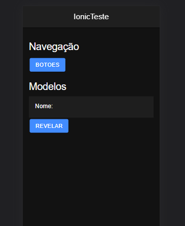
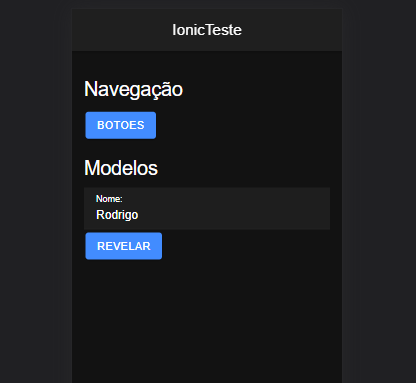
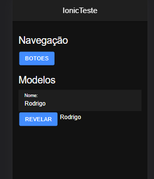
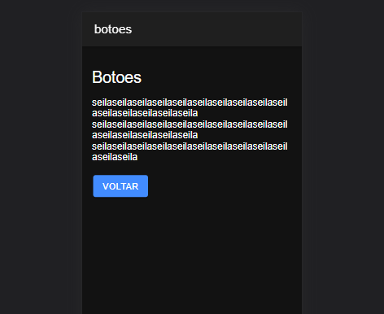

<h1 align="center"> IonicTeste </h1>

Aplicação de teste e estudo do Ionic

Preview da página Inicial (Zoom: 75%)

Preview da página com nome digitado (Zoom: 75%)

Preview da página com nome revelado (Zoom: 75%)

Preview da página de botões (Zoom: 75%)

## Ferramentas

- HTML
- CSS
- Bootstrap
- Typescript
- Fontawesome
- Ionic
- Angular
- Sass
- Git
- Github
